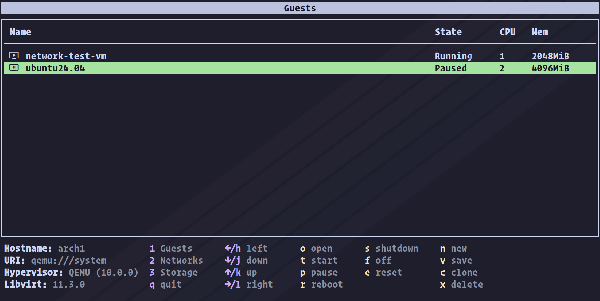

# 🖥️ virtui

**A fully interactive terminal UI app for managing KVM-based virtual machines via libvirt.**



Why...?

### 🎯 Initial project goals

- [ ] Connect to `qemu:///system` hypervisor
- [ ] Manage existing VMs (start, stop, pause, etc...)
- [ ] Create a filesystem directory storage pool
- [ ] Create storage volume in storage pool
- [ ] Create virtual network and connect to bridge
- [ ] Create a VM from ISO (using filesystem/storage/network)
- [ ] Connect VM console to host stdio

### 👑 Longer-term goals

- [ ] Feature parity with GUI tools like <a href="https://virt-manager.org/" target="_blank">virt-manager</a>


## 🚀 Quick start


## 👩‍💻 Usage


## 📦️ Dependencies

You'll need a working [libvirt](https://libvirt.org/) installation to make use of this software. Below are instructions to get that on Arch (feel free to submit a PR for instructions for other distros!).

### Arch

```sh
pacman -Sy fuse3 libvirt radvd qemu-base virt-manager dnsmasq # install dependencies
```

```sh
sudo systemctl enable --now libvirtd.service # enable libvirtd service
```

```sh
sudo usermod -aG libvirt $USER # add user to libvirt group
```

```sh
# /etc/libvirt/libvirtd.conf
unix_sock_group = "libvirt"
unix_sock_rw_perms = "0770"
```

```sh
# /etc/libvirt/network.conf
firewall_backend = "iptables"
```
> [!NOTE]  
> If you want to use LXC, you'll also need to install `virt-bootstrap-git` from the AUR.


## 🤝 Contributing


## 📃 License

[MIT](https://github.com/nixpig/virtui?tab=MIT-1-ov-file)

## Notes
- https://github.com/digitalocean/go-libvirt/issues/92
- https://github.com/free4inno/prometheus-libvirt-exporter/blob/9da210267ae14300fdd4d2036294e66bbecaa03b/collector/memory.go#L183
- https://github.com/free4inno/prometheus-libvirt-exporter/blob/9da210267ae14300fdd4d2036294e66bbecaa03b/collector/cpu.go
- https://github.com/kubevirt/kubevirt/blob/main/pkg/virt-launcher/virtwrap/cli/libvirt.go#L506
